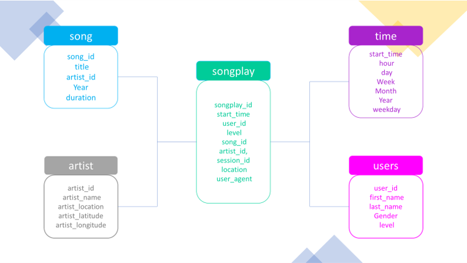

# Project 1: Data modeling with Postgres
this is the frist Udacity Data Engineering nanodegree project.
## Overrview
this project is for handling the data generated by the fictional music streaming comany called Sparkify.by apply what I've learned on data modeling with Postgres and build an ETL pipeline using Python. To complete the project, I needed to define fact and dimension tables for a star schema for a particular analytic focus, and write an ETL pipeline that transfers data from files in two local directories into these tables in Postgres using Python and SQL.

Data generated is of two types and are composed of set of JSON files:
- Songs Dataset: consists of files in JSON format and each file contain metadata about a song and the artist of that song and they are stored in the ./data/song_data folder.
- Log Dataset: consists of log files in JSON format generated by this event simulator based on the songs dataset. These simulate activity logs from a music streaming app and they are stord in ./data/log_data

## Schema for Song Play Analysis
Here is a describes of the database sparkifydb, designed in a star schema. The database type is PostgreSQL.

Using the song and log datasets, you'll need to create a star schema optimized for queries on song play analysis. This includes the following tables.

### Fact Table
- songplays info columns: 

   >songplay_id, start_time, user_id, level, song_id, artist_id, session_id, location, user_agent

### Dimension Tables
- users - users info columns: 

  > user_id, first_name, last_name, gender, level
- songs - songs info columns:  

  > song_id, title, artist_id, year, duration
- artists - artistsinfo columns: 

  > artist_id, name, location, latitude, longitude
  
- time - info columns: 

  > start_time, hour, day, week, month, year, weekday

## Project Steps
Below are steps you can follow to complete the project:

### Create Tables
- Write `CREATE` statements in `sql_queries.py` to create each table.
- Write `DROP` statements in `sql_queries.py` to drop each table if it exists.
- Run `create_tables.py` to create your database and tables.
- Run `test.ipynb` to confirm the creation of your tables with the correct columns. Make sure to click "Restart kernel" to close the connection to the database after running this notebook.

### Build ETL Processes
Follow instructions in the `etl.ipynb` notebook to develop ETL processes for each table. At the end of each table section, or at the end of the notebook, run `test.ipynb` to confirm that records were successfully inserted into each table. Remember to rerun create_tables.py to reset your tables before each time you run this notebook.

### Build ETL Pipeline
Use what you've completed in `etl.ipynb` to complete etl.py, where you'll process the entire datasets. Remember to run create_tables.py before running etl.py to reset your tables. Run `test.ipynb` to confirm your records were successfully inserted into each table.